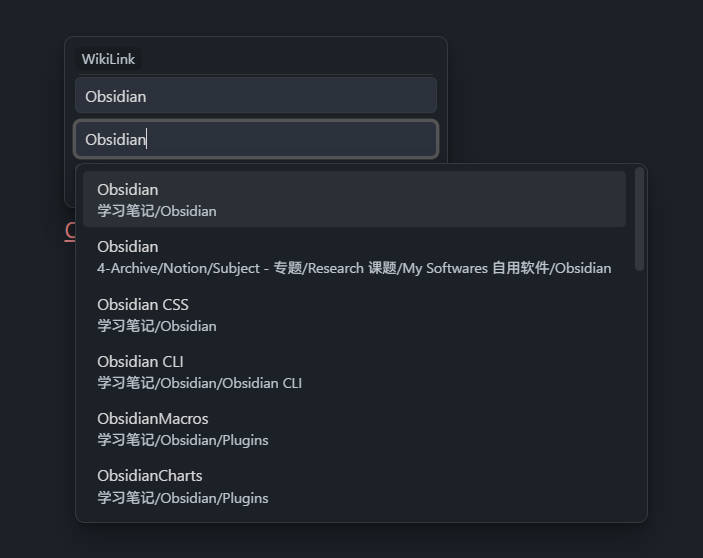

# Changelog

All notable changes to this project will be documented in this file.
本项目的重要变更会记录在此文件中。

## [1.1.0] - 2026-03-19

### Link suggestion

### English

#### Added

- **Link suggestion dropdown**: When editing a wiki/markdown link destination, an autocomplete dropdown appears showing matching notes and headings from the vault.
  - File mode (default): fuzzy-search all vault files; non-Markdown files are shown in a dimmed style with their file extension.
  - Heading mode: type `#` after a filename to list and search headings within that file.
  - Respects Obsidian's internal link format setting (shortest path / absolute / relative).
- **Alias sync on selection** (optional, off by default): when selecting a heading from the suggestion list, automatically fill in the display text (alias).

- **Embed toggle button**: a dedicated button in the popover footer to toggle the `!` embed prefix on wiki/markdown links.
- **Ctrl+Click to force-delete**: Ctrl/Cmd+clicking the delete button removes the link completely regardless of the "preserve text" setting.
- **Icon**: Plugin now shows an icon in the settings sidebar.

#### Fixed

- Suggestion dropdown no longer reopens after selecting an item.
- Mouse clicks on the suggestion dropdown no longer close the popover editor prematurely.
- Language detection now correctly identifies from Obsidian's interface language instead of the system language.

### 中文

#### 新增

- **链接建议下拉菜单**：在编辑 WikiLink / Markdown 链接目标时，自动显示库内文件和标题的模糊搜索候选列表。
  - 文件模式（默认）：检索所有文件；非 Markdown 文件以减弱颜色和后缀名显示。
  - 标题模式：在文件名后输入 `#`，列出并检索该文件的所有标题。
  - 遵循 Obsidian 的内部链接类型设置（最短路径 / 绝对路径 / 相对路径）。
- **选中时同步别名**（可选，默认关闭）：从候选列表选中标题时，自动填入显示文本。

- **嵌入切换按钮**：弹窗底部新增按钮，可快速切换链接前的 `!` embed 前缀。
- **Ctrl+Click 强制删除**：按住 Ctrl/Cmd 点击删除按钮时，无论「保留文本」设置如何，都会完整移除链接。
- **图标**：插件在设置侧边栏中现在有图标。

#### 修复

- 修复：选中候选项后下拉菜单会重新弹出的问题。
- 修复：在候选菜单上点击鼠标时会意外关闭弹窗编辑器的问题。
- 修复：语言检测现在正确从 Obsidian 的界面语言而非系统语言识别。

## [1.0.4] - 2026-03-19

### English

#### Added

- New setting "Validate internal links" (enabled by default): when editing an internal link target, automatically check whether the destination file or heading exists via Obsidian's metadataCache with 300ms debounce.
- If validation fails, the destination input gets a warning style and saving is blocked with a Notice.
- ESC now discards edits and closes the popover without saving.

#### Changed

- Increased spacing between the two input fields in the popover editor.
- Added right-side boundary buffer (4px) for edge protection, matching the existing left-side buffer.

### 中文

#### 新增

- 新增"校验内部链接有效性"设置（默认启用）：编辑内部链接目标时，自动通过 Obsidian metadataCache 检测对应文件或标题是否存在（300ms 防抖）。
- 校验失败时，目标输入框显示警告样式，阻止保存并弹出 Notice 提示。
- ESC 键现在放弃编辑并直接关闭弹窗，不再保存改动。

#### 变更

- 增大弹窗编辑器中两个输入框的间距。
- 边界保护新增右侧缓冲区（4px），与左侧保持一致。

## [1.0.3] - 2026-03-19

### English

#### Fixed

- Classify image links by destination file extension instead of `!` embed prefix alone.
- Treat embeds like `![[BetterLinks#related|related]]` as non-image links when the destination has no image extension.
- Preserve the original `!` embed prefix when editing and saving non-image embeds.

### 中文

#### 修复

- 图片链接改为按目标后缀名识别，不再仅根据 `!` embed 前缀判断。
- 对于 `![[BetterLinks#相关|相关]]` 这类目标不含图片后缀的 embed，按非图片链接处理。
- 编辑并保存非图片 embed 时，保留原始 `!` 前缀。

## [1.0.2] - 2026-03-19

### English

#### Changed

- Standardized changelog format to keep full English notes first and full Chinese notes second.
- Added release workflow guidance in the ops skill so future releases consistently include bilingual changelog notes.

#### Fixed

- Only open the link editor when clicking directly on link text.
- Do not open the editor when clicking after a link (for example right after `)`).
- Do not open the editor when the clicked link is inside the current text selection.
- Restore click interception only for valid link clicks so default behavior is not broken elsewhere.

### 中文

#### 变更

- 统一了 changelog 结构：先完整英文，再完整中文。
- 在 ops skill 中补充发布规范，确保后续发版会稳定包含双语 changelog 内容。

#### 修复

- 仅当直接点击链接文本时才打开链接编辑弹窗。
- 点击链接末尾之后的位置（例如 `)` 后）时不再打开弹窗。
- 当被点击链接位于当前选中文本内时，不再打开弹窗。
- 仅在有效链接点击时拦截事件，避免破坏其他位置的默认点击行为。

## [1.0.1] - 2026-03-19

### English

#### Added

- Initial stable release.

### 中文

#### 新增

- 首个稳定版本发布。
