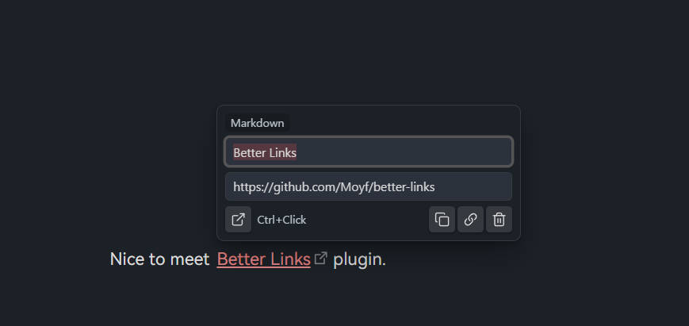
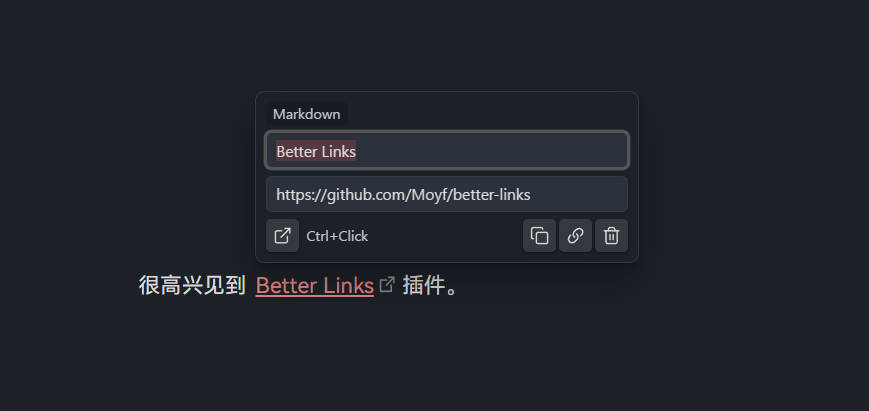

# Better Links

[中文](#中文) | [English](#english)

## English

Better Links is an Obsidian plugin for quick link editing in the Markdown editor.
Click a link to open a small popover where you can edit text/target and run quick actions.

### Features

- Supports WikiLinks, Markdown links, plain URLs, and image-form links.
- Normal click opens the editor popover.
- Ctrl/Cmd + Click opens the link directly.
- Quick actions:
  - Open link
  - Copy link in preferred format
  - Copy URL or file name (for image links)
  - Delete link (hidden for image links)
- Localized UI (English + Chinese).
- Support suggestion for internal links and heading. 
  - Auto-complete files and headings in the vault, quickly select and insert link targets.
  - Automatically update display text.

### Notes

- External URLs are always copied as Markdown links.
- Internal links and image links follow Obsidian link format setting (WikiLink vs Markdown).
- **Mobile (iOS)**: In "Click" trigger mode, tapping a collapsed link in Live Preview will open the editor popover instead of navigating. Due to technical constraints, scrolling cannot begin from a link area — start your scroll gesture from a non-link area instead.

### Declaration

1. This idea and solution are inspired by [Octarine](https://octarine.app/).
2. This project is based on David V. Kimbal's [obsidian-sample-plugin-plus](https://github.com/davidvkimball/obsidian-sample-plugin-plus) and was developed with AI assistance; I actively install it in my own vault for frontline testing and daily use.

---

## 中文

Better Links 是一个 Obsidian 插件，用于在 Markdown 编辑器中快速编辑链接。
点击链接会弹出轻量浮窗，可直接修改文本和目标，并执行快捷操作。

### 功能

- 支持 Wikilink、Markdown 链接、纯 URL、图片类链接。
- 普通点击打开浮窗。
- Ctrl/Cmd + 点击直接打开链接。
- 快捷操作：
  - 打开链接
  - 按设置复制链接格式
  - 复制 URL（图片类复制文件名）
  - 删除链接（图片类隐藏删除按钮）
- 支持中英文界面。
- 内部链接建议功能。
  - 支持自动补全库内文件和标题，快速选择并插入链接目标。
  - 自动更新显示名称。

### 说明

- 外部网址始终按 Markdown 链接格式复制。
- 内部链接和图片链接会跟随 Obsidian 的链接格式设置（Wikilink / Markdown）。
- **移动端（iOS）**：「点击」触发模式下，点击 Live Preview 中折叠的链接会打开编辑浮窗而非跳转。由于技术限制，从链接区域无法发起滚动手势——请从非链接区域开始滑动。

### 声明

1. 这个想法和方案灵感来自 [Octarine](https://octarine.app/)。
2. 该项目基于 David V. Kimbal 的 [obsidian-sample-plugin-plus](https://github.com/davidvkimball/obsidian-sample-plugin-plus) ，由 AI 进行开发；我会第一时间将插件安装到自己的库中进行测试和实际使用。
